# UNIP Achados e Perdidos — Documentação Técnica

---

## 1. Identificação Institucional

- **Instituição**: Universidade Paulista (UNIP)
- **Curso**: Ciência da Computação
- **Disciplina**: Banco de Dados / Projeto Integrado

### Integrantes do Grupo

- José Victor Souza Silva - R8740F6 - CC4P17
- Marcio Rafael Cisterna da Silva - R2154H8 - CC4Q17
- Diego Lubek Moura da Silva - R825HF3 - CC4P17
- Samuel Henri da Luz Nogueira - H713BE6 - CC4Q17
- Nicole Relíquia Vale Marques - R540740 - CC4Q17
- Carlos Eduardo de Oliveira Carvalho - R142787 - CC4P17

---

## 2. Descrição do Projeto

### 2.1. Apresentação do Tema
O **UNIP Achados e Perdidos** é um sistema web acadêmico projetado para o fluxo de cadastro, localização e devolução de pertences esquecidos ou encontrados nas dependências do campus universitário.

### 2.2. Regras de Negócio
1. **Autenticação por Registro Acadêmico (RA)**: Todo usuário deve ser previamente cadastrado com seu RA e senha para registrar ou resgatar pertences.
2. **Níveis de Acesso**:
   - **Aluno/Usuário Comum**: Pode cadastrar novos objetos (perdidos ou encontrados), consultar o catálogo público e gerenciar seus próprios itens cadastrados.
   - **Administrador**: Possui privilégios para gerenciar o catálogo completo, controlar usuários e registrar devoluções formais de objetos.
3. **Ciclo de Vida do Objeto**:
   - Status inicial: `Perdido` ou `Encontrado`.
   - Transição de status: Um item passa para `Devolvido` exclusivamente quando a entrega é confirmada e registrada no sistema.
4. **Registro de Devolução**: Toda devolução gera um vínculo histórico imutável contendo a data/hora, o responsável pela entrega e observações relevantes.

### 2.3. Escopo Funcional
- **Módulo de Autenticação**: Cadastro e Login de usuários via RA.
- **Módulo de Objetos (CRUD)**:
  - **Create**: Cadastro de objetos com nome, descrição, cor, marca, status, local no campus e contato.
  - **Read**: Listagem dinâmica de objetos com busca textual em tempo real e filtragem por status (`Perdido`, `Encontrado`, `Devolvido`).
  - **Update**: Edição de dados de pertences cadastrados.
  - **Delete**: Remoção de registros do sistema.
- **Módulo de Usuários (CRUD)**: Painel administrativo para criação, edição e alteração do nível de acesso (`aluno` / `admin`).
- **Módulo de Devoluções**: Painel administrativo para registrar e consultar o histórico formal de itens devolvidos aos proprietários.

---

## 3. Arquitetura e Tecnologias

### Back-end (Java)
- **Linguagem**: Java 17+ puro (apenas com bibliotecas nativas e utilitárias, sem frameworks de aplicação).
- **Arquitetura**:
  - **MVC (Model-View-Controller)**: Separação de modelos de dados (`model`), controladores de requisição HTTP REST (`controller`) e visões tratadas pelo front-end.
  - **DAO (Data Access Object)**: Classes dedicadas no pacote `com.findcampus.dao` para encapsular todas as instruções SQL via `PreparedStatement`.
  - **DAL (Data Access Layer)**: Gerenciamento centralizado da conexão JDBC e tratamento de exceções MySQL no pacote `com.findcampus.dal`.
- **Dependências Externas**:
  - `Gson 2.10.1`: Serialização e desserialização de objetos JSON.
  - `MySQL Connector/J 8.0.33`: Driver JDBC oficial para comunicação com o banco de dados.

### Front-end (Nativo em HTML5, CSS3 e JavaScript ES6)
- **Tecnologias**: HTML5 Semântico, CSS3 puro com variáveis e layout responsivo (Flexbox/Grid), JavaScript ES6 puro (Vanilla JS).
- **Comunicação API**: Requisições HTTP REST centralizadas via `fetch()` nativo do navegador para o endereço `http://localhost:8080`.
- **Sessão**: Gerenciada nativamente via `localStorage` com controle de permissões por perfil (`aluno` / `admin`).
- **Livre de Frameworks**: Sem dependência de React, Angular, Vue, Tailwind CSS, Bootstrap ou bibliotecas externas.

### Banco de Dados
- **SGBD**: MySQL Server 8.0+.

---

## 4. Modelagem de Dados

### 4.1. Diagrama Entidade-Relacionamento (DER)

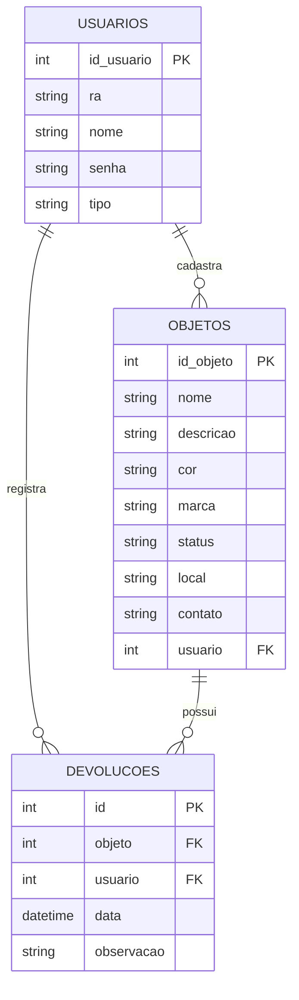

### 4.2. Script DDL Completo (Criação de Tabelas e Restrições)

```sql
-- Criação do banco de dados para a aplicação UNIP Achados e Perdidos
CREATE DATABASE IF NOT EXISTS trabalho_facul;
USE trabalho_facul;

-- Tabela de Usuários
CREATE TABLE IF NOT EXISTS usuarios (
    id_usuario INT AUTO_INCREMENT PRIMARY KEY,
    ra         VARCHAR(50) NOT NULL,
    nome       VARCHAR(100) NOT NULL,
    senha      VARCHAR(255) NOT NULL,
    tipo       VARCHAR(50) NOT NULL DEFAULT 'aluno'
) ENGINE=InnoDB;

-- Tabela de Objetos
CREATE TABLE IF NOT EXISTS objetos (
    id_objeto INT AUTO_INCREMENT PRIMARY KEY,
    nome      VARCHAR(100) NOT NULL,
    descricao TEXT,
    cor       VARCHAR(50),
    marca     VARCHAR(100),
    status    VARCHAR(50) NOT NULL,
    local     VARCHAR(255),
    contato   VARCHAR(255),
    usuario   INT,
    CONSTRAINT fk_objetos_usuario FOREIGN KEY (usuario) REFERENCES usuarios(id_usuario) ON DELETE CASCADE
) ENGINE=InnoDB;

-- Tabela de Devoluções
CREATE TABLE IF NOT EXISTS devolucoes (
    id         INT AUTO_INCREMENT PRIMARY KEY,
    objeto     INT NOT NULL,
    usuario    INT NOT NULL,
    data       DATETIME NOT NULL DEFAULT CURRENT_TIMESTAMP,
    observacao TEXT,
    CONSTRAINT fk_devolucoes_objeto  FOREIGN KEY (objeto)  REFERENCES objetos(id_objeto) ON DELETE CASCADE,
    CONSTRAINT fk_devolucoes_usuario FOREIGN KEY (usuario) REFERENCES usuarios(id_usuario) ON DELETE CASCADE
) ENGINE=InnoDB;

-- Carga Inicial de Dados para Testes
INSERT INTO usuarios (ra, nome, senha, tipo) VALUES 
('123456', 'Administrador UNIP', '123456', 'admin'),
('202611', 'Aluno Exemplo', '123456', 'aluno');
```

---

## 5. Guia de Instalação e Execução

### 5.1. Pré-requisitos
- **Java Development Kit (JDK)** 17 ou superior.
- **MySQL Server** v8.0+.
- Navegador Web moderno (Google Chrome, Firefox, Edge, Safari).

---

### 5.2. Passo 1: Configuração do Banco de Dados
1. Inicie o serviço do MySQL Server.
2. Execute o script DDL contido em `backend/banco_de_dados.sql` (ou o trecho da Seção 4.2) em seu cliente MySQL (Workbench, DBeaver ou via CLI).
3. Verifique as credenciais de acesso no arquivo `backend/src/main/java/com/findcampus/dal/DatabaseConfig.java`:
   ```java
   private static final String URL = "jdbc:mysql://localhost:3306/trabalho_facul";
   private static final String USER = "seu_usuario";
   private static final String PASS = "sua_senha";
   ```

---

### 5.3. Passo 2: Execução do Back-end (Servidor Java)

#### Opção A — Via IDE (IntelliJ IDEA / Eclipse / VS Code)
1. Abra a pasta `backend` na IDE.
2. Certifique-se de adicionar as bibliotecas `.jar` da pasta `backend/lib/` ao Classpath do projeto (`gson-2.10.1.jar` e `mysql-connector-j-8.0.33.jar`).
3. Execute o método `main` da classe `com.findcampus.Main`.
4. O servidor iniciará na porta **8080** exibindo a confirmação de inicialização no console.

#### Opção B — Via Linha de Comando (CLI)
No diretório `backend`, execute:

```bash
# Compilar os arquivos-fonte Java
find src/main/java -name "*.java" | xargs javac -cp "lib/gson-2.10.1.jar:lib/mysql-connector-j-8.0.33.jar" -d bin

# Executar a aplicação
java -cp "bin:lib/gson-2.10.1.jar:lib/mysql-connector-j-8.0.33.jar" com.findcampus.Main
```

---

### 5.4. Passo 3: Execução do Front-end (HTML5 + CSS3 + JS Puro)

Por ser uma aplicação web baseada em padrões nativos (Vanilla JS), existem duas maneiras simples de executar:

#### Opção A — Abrindo diretamente no navegador
1. Abra o gerenciador de arquivos e navegue até a pasta `frontend`.
2. Dê um duplo clique no arquivo `index.html` ou `login.html` para abrir diretamente em seu navegador preferido.

#### Opção B — Via Servidor Estático Simples (Live Server / npx serve)
No diretório `frontend`, execute via terminal:

```bash
# Servir arquivos estáticos usando npx
npx serve -l 5173 .
```

Acesse no seu navegador o endereço `http://localhost:5173` ou abra via extensão **Live Server** do VS Code.

---

## 6. Evidências Visuais

Esta seção apresenta as capturas de tela demonstrando a interface do sistema web em funcionamento, as operações de CRUD executadas e a persistência dos dados no banco de dados MySQL.

---

### 6.1. Diagrama Entidade-Relacionamento (Modelagem)
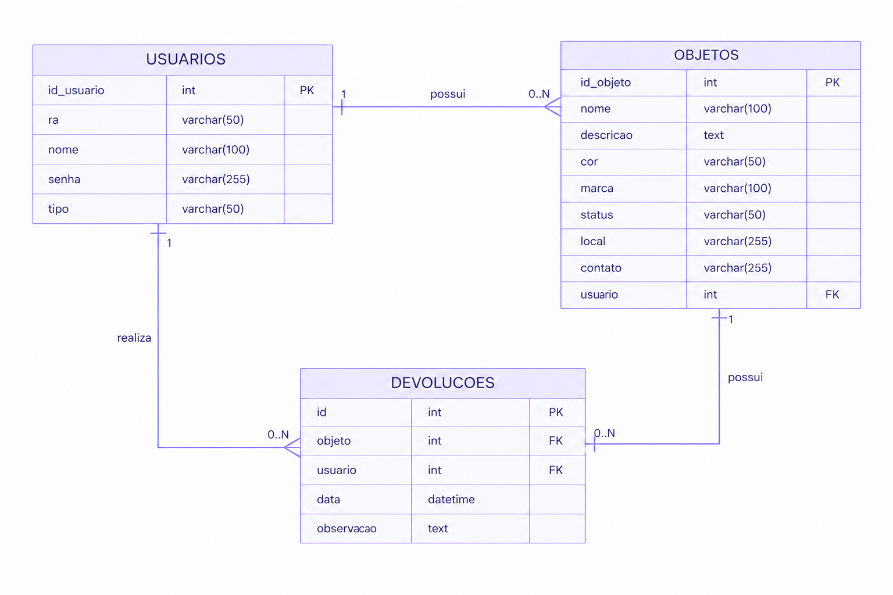

---

### 6.2. Autenticação e Cadastro
#### Tela de Login
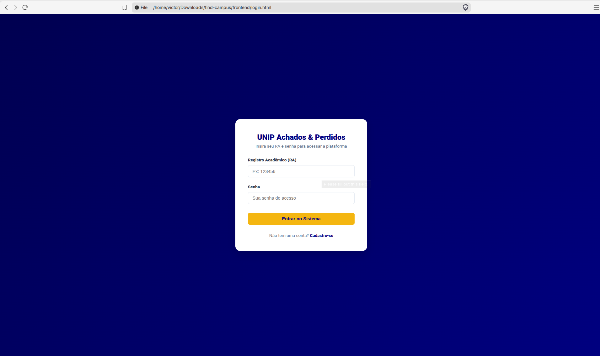

#### Tela de Cadastro de Usuário (Aluno)
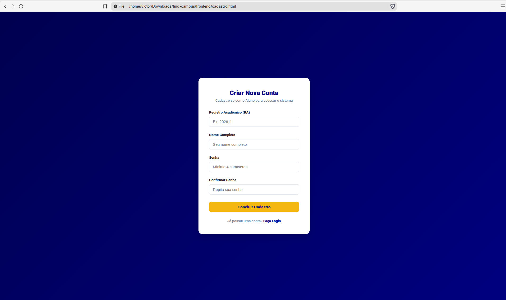

---

### 6.3. Painel Principal (Dashboard) e Perfil
#### Visão Geral do Dashboard
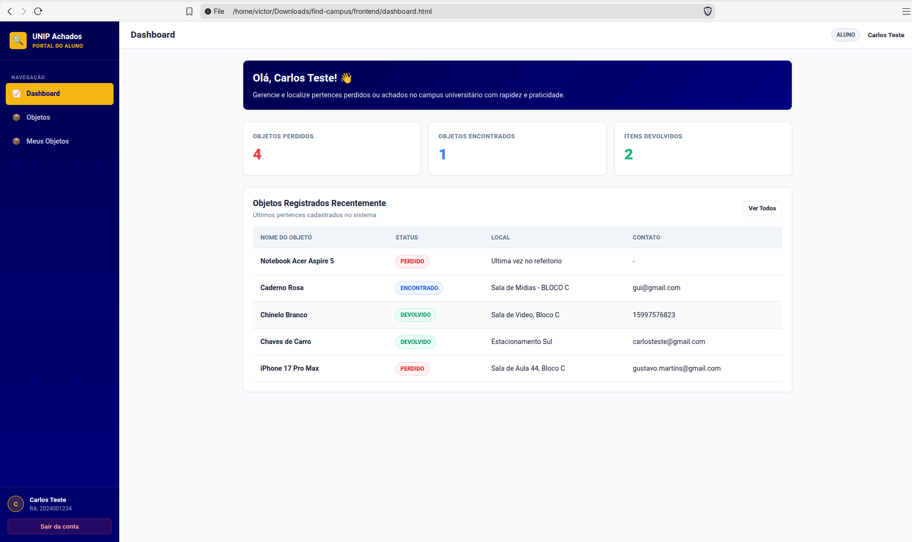

#### Meus Objetos Cadastrados
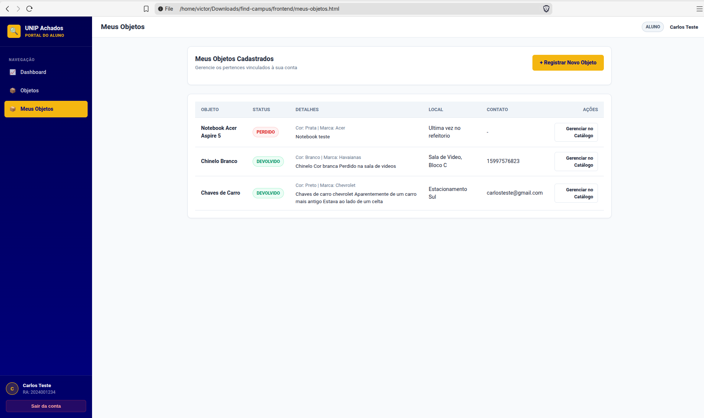

---

### 6.4. Operações CRUD de Objetos
#### Catálogo Geral de Objetos
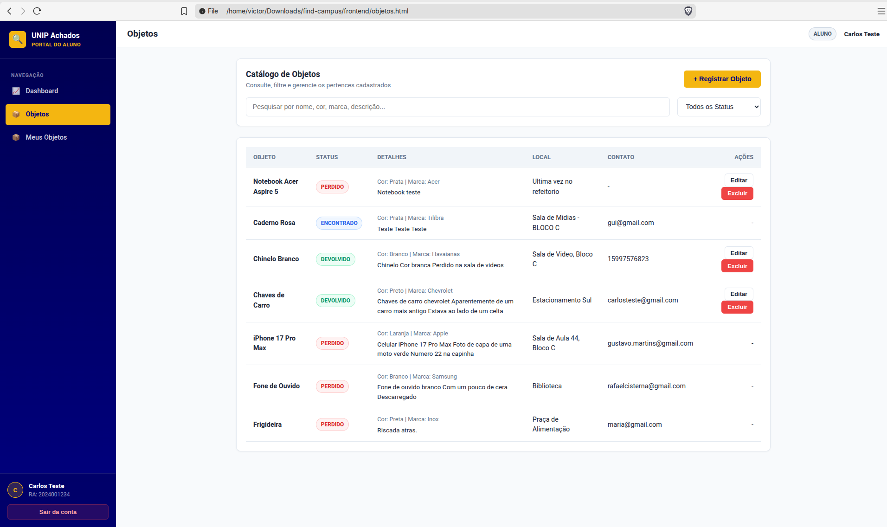

#### Registrar Novo Objeto


#### Editar Objeto
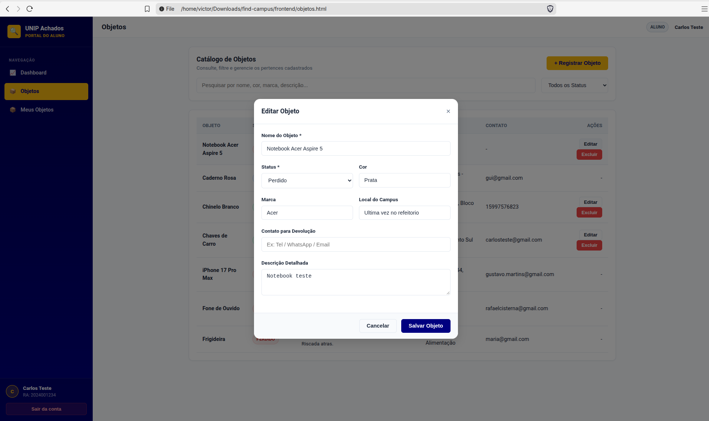

#### Excluir Objeto
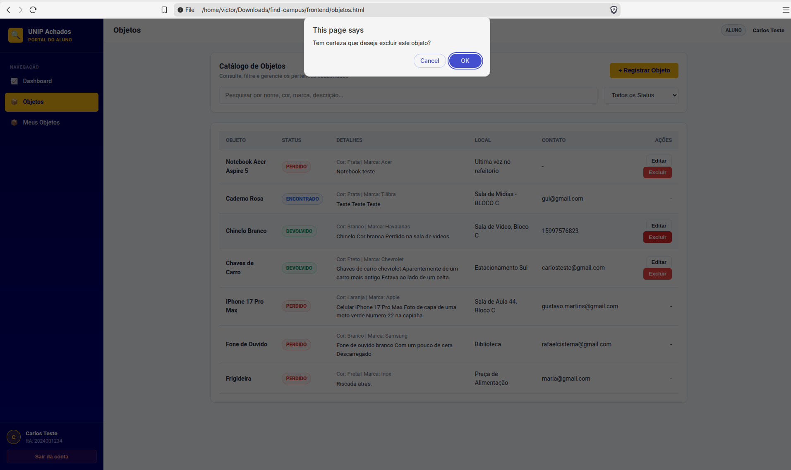

---

### 6.5. Operações Administrativas (Devoluções e Usuários)
#### Painel de Devoluções
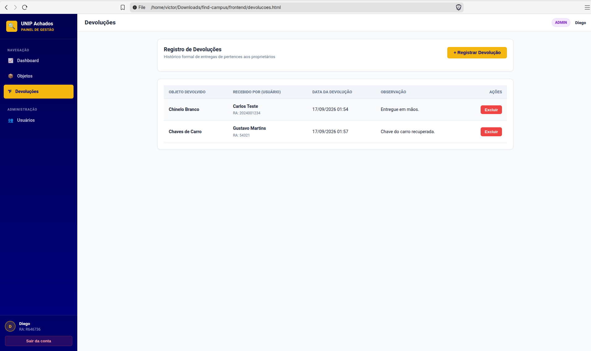

#### Registrar Nova Devolução
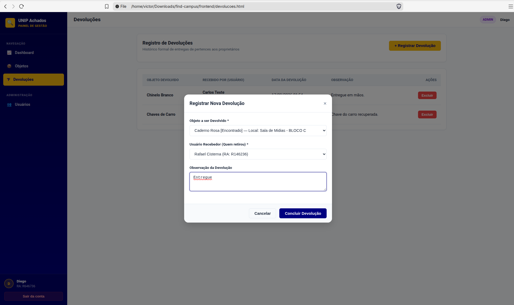

#### Gestão de Usuários (Administrador)
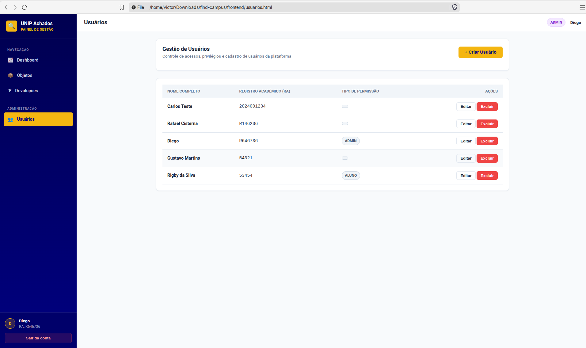

#### Editar Usuário (Administrador)
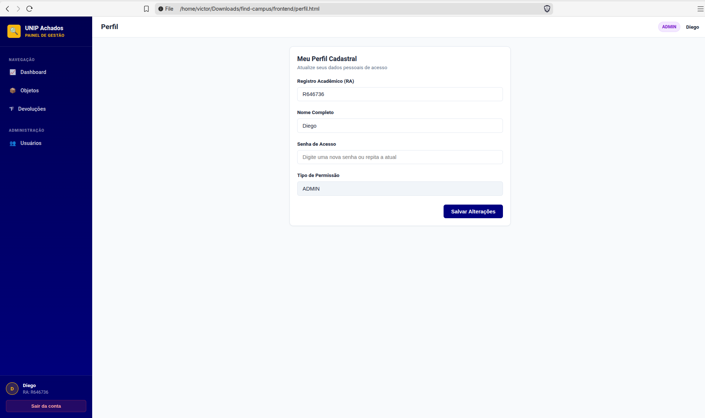

---

### 6.6. Persistência de Dados no Banco de Dados (MySQL)
#### Tabela `usuarios`
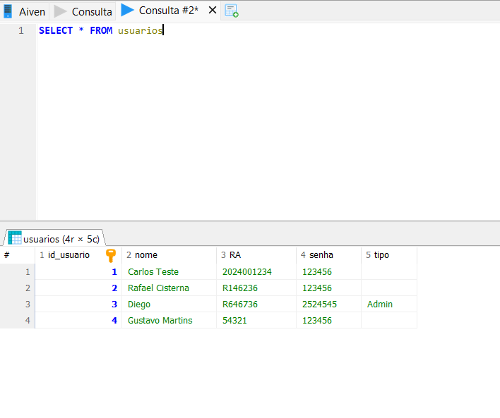

#### Tabela `objetos`
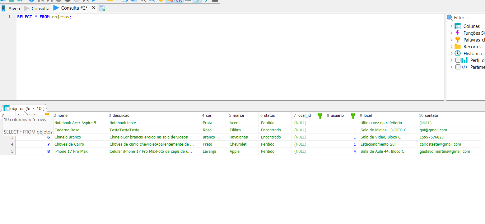

#### Tabela `devolucoes`
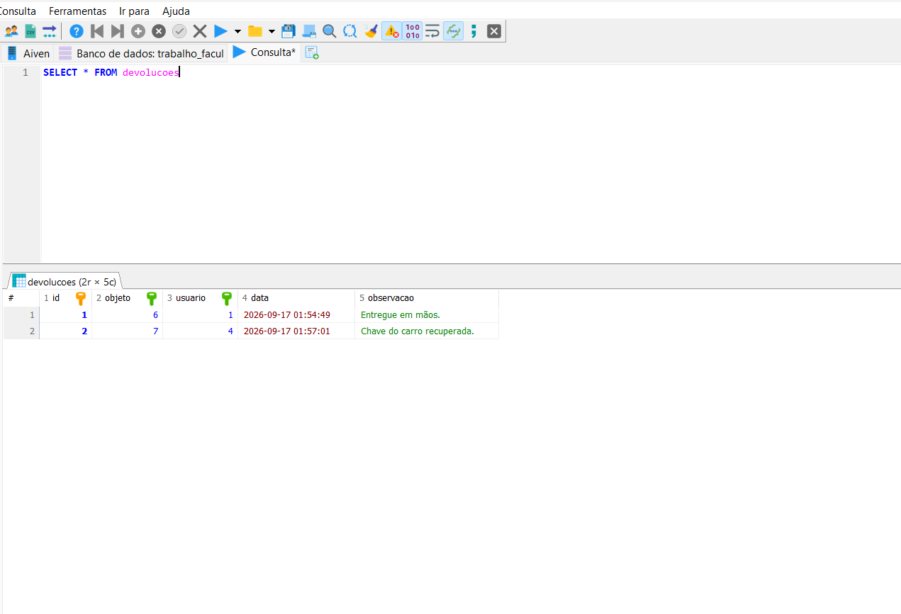


- José Victor Souza Silva - RA: R8740F6 - Turma: CC4P17
- Marcio Rafael Cisterna da Silva - RA: R2154H8 - Turma: CC4Q17
- Nicole Reliquia - RA:  - Turma: 
- Diego Lubek Moura da Silva - RA: R825HF3 - Turma: CC4P17
- Carlos Eduardo de Oliveira Carvalho - RA: R142787 - Turma: CC4P17
- Samuel Henri da Luz Nogueira - RA: H713BE6 - Turma: CC4Q17
